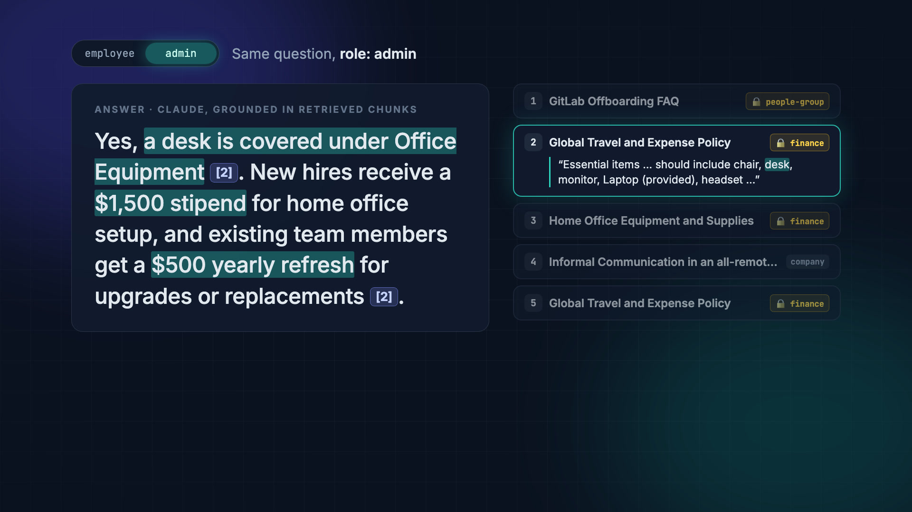
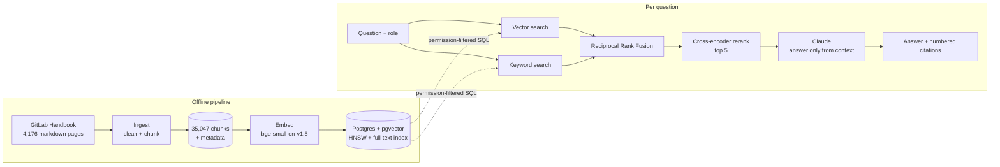

# 📘 Wikiwise

**Cited answers from your company handbook, scoped to who's asking.**

Wikiwise is a permission-aware RAG (retrieval-augmented generation) assistant built on the real, public [GitLab Handbook](https://handbook.gitlab.com/), which stands in for a company's internal docs: 4,176 pages across HR, finance, legal, engineering, sales and more. Ask a question and you get a short answer written by Claude that cites the exact handbook passages it used. Who you are also matters: HR, finance and legal pages stay hidden from roles that aren't allowed to see them.

[](https://wikiwise-ae936gyryj852bdxdkgvc5.streamlit.app/)


## Demo video

[](assets/wikiwise-demo.mp4)

*30 seconds, all real: the full pipeline running (ingest → embed → index → eval → deploy), then the same question asked as `employee` and as `admin`. Click the image to play it.*

## Try it

**Live app:** https://wikiwise-ae936gyryj852bdxdkgvc5.streamlit.app/

1. Paste your own [Anthropic API key](https://console.anthropic.com/) into the sidebar. It's only kept for your browser session and never stored.
2. Pick a **role**: `employee` can't see restricted departments, `admin` can see everything.
3. Ask a question about working at GitLab.

Ask this one as both roles to see permissions in action:

> **Can I expense a home office desk at GitLab?**

| Role | What happens |
|---|---|
| `employee` | The answer comes from public culture pages only and hedges: the handbook text it's allowed to see doesn't explicitly say a desk is reimbursable. |
| `admin` | The answer cites the restricted **finance** expense policy: a desk counts as Office Equipment, new hires get a $1,500 home-office stipend, and there's a $500 yearly refresh. |

## How it works



1. **Ingest** ([pipeline/ingest.py](pipeline/ingest.py)). Reads every handbook page and strips Hugo shortcodes, mermaid diagrams and HTML while keeping the words they carried. Each page is split with LangChain's Markdown-aware splitter (1,500 characters, 150 overlap). Every chunk is tagged with its title, heading, department, source URL and a `restricted` flag. Restricted departments are `people-group`, `people-policies`, `total-rewards`, `finance`, `legal` and `labor-and-employment-notices`, which together hold about 10.6% of chunks.
2. **Embed + index** ([pipeline/embed.py](pipeline/embed.py), [wikiwise/load_vectordb.py](wikiwise/load_vectordb.py)). Embeds every chunk locally with `BAAI/bge-small-en-v1.5` (384 dimensions; on Apple Silicon it uses the GPU through MPS). No API is called and nothing leaves the machine. The vectors are upserted into a Postgres `chunks` table with an HNSW cosine index, a GIN full-text index, and indexes on `department` and `restricted`.
3. **Retrieve** ([wikiwise/retrieve.py](wikiwise/retrieve.py)). Runs vector search and keyword search side by side, about 30 candidates each. **The permission filter is applied in the SQL itself**, so restricted chunks never even become candidates for a role that can't see them. The two result lists are merged with Reciprocal Rank Fusion, then reranked by `cross-encoder/ms-marco-MiniLM-L-6-v2` down to the top 5.
4. **Generate** ([wikiwise/generate.py](wikiwise/generate.py)). Claude answers **only** from the numbered passages, cites them inline as `[1]`, `[2]` and so on, and says plainly when the context isn't enough instead of guessing. Answers stream into the UI, and LangSmith traces every call along with its token usage.
5. **App** ([app.py](app.py)). A Streamlit chat UI with a role selector, a bring-your-own-key field, and an expandable source list under each answer.

There's also an experimental [pipeline/build_knowledge_graph.py](pipeline/build_knowledge_graph.py), which uses Claude to pull an entity–relationship graph (people, teams, tools, policies) out of a sample of handbook pages.

## Evaluation

Every metric below is measured against a hand-built **golden dataset** of 63 questions from 36 departments ([evals/golden_dataset.jsonl](evals/golden_dataset.jsonl)). Each question comes with the chunk that contains its answer and a reference answer. 9 of the questions come from restricted departments.

### Retrieval and permissions ([evals/eval_retrieval.py](evals/eval_retrieval.py))

| Metric | Result |
|---|---|
| Recall@1 / @3 / @5 / @10 | **73.0% / 84.1% / 90.5% / 92.1%** |
| Permission leak rate: restricted questions asked as `employee` | **0.0%** (0 of 9 questions leaked any restricted chunk) |
| Contextual precision / recall @5 (LLM-judged) | 0.80 / 0.89 |
| Contextual relevancy @5 (LLM-judged) | 0.42 |

The recall and leak-rate figures come from the 2026-10-07 run recorded in the demo video, on a freshly rebuilt index. The LLM-judged contextual metrics come from the earlier full run on 2026-09-24 (judge: `qwen2.5:7b` via Ollama), when Recall@5 was 79.4%. Contextual relevancy is low because 5 chunks of about 1,000 characters each carry a lot of text that's true but unrelated to the question. It isn't a sign that the wrong chunks were retrieved.

### Generation and end-to-end ([evals/eval_generator.py](evals/eval_generator.py), [evals/eval_pipeline.py](evals/eval_pipeline.py))

| Metric | Result |
|---|---|
| Faithfulness: does the answer stick to the retrieved context? | **0.95** |
| Answer relevancy | **0.93** |
| Correctness against the reference answer | 0.74 |
| Completeness against the reference answer | 0.76 |

All four are judged with DeepEval: faithfulness and relevancy by Claude Haiku 4.5, and correctness and completeness by G-Eval rubrics. A separate run compared how many passages the generator gets: 5 chunks scored 0.98 for faithfulness and 0.93 for relevancy, versus 0.98 and 0.91 with 8 chunks ([evals/results/](evals/results/)).

### Guardrails ([evals/guardrails.py](evals/guardrails.py))

All 63 generated answers were scanned for four risks: going off-topic, leaking data, exposing personal information (PII), and toxic language.

| Check | Flagged |
|---|---|
| Toxicity | 0 / 63 |
| Off-topic (scope) | 2 / 63 |
| PII | 2 / 63 |
| Data leakage | 3 / 63 |

The flags are the LLM judge's calls on answers generated with the `admin` role, so they're kept here as found rather than filtered out. The full per-question results are in [evals/results/guardrails_results.json](evals/results/guardrails_results.json).

## Project structure

```
app.py                  Streamlit UI (entry point)
wikiwise/               runtime code used by the app
  retrieve.py           hybrid search, permission filter, RRF, rerank
  generate.py           grounded Claude answers with citations
  load_vectordb.py      pgvector schema + upsert, DATABASE_URL config
pipeline/               offline data build
  ingest.py             handbook → cleaned, chunked, tagged JSONL
  embed.py              local embeddings → pgvector
  build_knowledge_graph.py
evals/                  golden dataset, eval + guardrail scripts
  results/              saved metric runs
assets/                 demo video + poster
Dockerfile              container image for the app
requirements.txt        slim runtime deps (CPU-only torch)
requirements-dev.txt    full dev environment (evals, ingest, etc.)
```

Generated data (`data/`) and the cloned handbook (`handbook/`) are git-ignored.

## Run it locally

You'll need Python 3.13 and Docker (for a local pgvector database), or a hosted Postgres with pgvector such as [Neon](https://neon.tech).

```bash
git clone https://github.com/DEKU-12/Wikiwise.git && cd Wikiwise
python3.13 -m venv venv && source venv/bin/activate
pip install -r requirements-dev.txt
```

Create a `.env` file in the project root:

```bash
ANTHROPIC_API_KEY=sk-ant-...
DATABASE_URL=postgresql://...         # optional; defaults to the local Docker DB below
LANGSMITH_TRACING=true                # optional
LANGSMITH_API_KEY=...                 # optional
LANGSMITH_PROJECT=wikiwise            # optional
```

Start a local pgvector database (skip this if you use `DATABASE_URL`):

```bash
docker run -d --name wikiwise-pgvector -e POSTGRES_USER=wikiwise -e POSTGRES_PASSWORD=wikiwise -e POSTGRES_DB=wikiwise -p 5433:5432 pgvector/pgvector:pg16
```

Build the index. Run these from the project root as modules:

```bash
git clone --depth 1 https://gitlab.com/gitlab-com/content-sites/handbook.git handbook
python -m pipeline.ingest      # about 6s: 35,047 chunks → data/chunks.jsonl
python -m pipeline.embed       # about 5 min on Apple Silicon: embed + load into pgvector
```

Run the app, or try the command-line versions:

```bash
streamlit run app.py
python -m wikiwise.generate    # interactive Q&A in the terminal
python -m wikiwise.retrieve    # inspect raw retrieval results
```

Run the evals (they need the index; `eval_retrieval` also needs Ollama with `qwen2.5:7b`):

```bash
python -m evals.eval_retrieval
python -m evals.eval_generator
python -m evals.eval_pipeline
python -m evals.guardrails
```

### Docker

```bash
docker build -t wikiwise .
docker run --env-file .env -p 8501:8501 wikiwise
```

The image installs only `requirements.txt`, with CPU-only torch, so it comes to about 2.4 GB.

## Deployment

The live app runs on **Streamlit Community Cloud** from this repo's `main` branch:

- Main file: `app.py`
- Secret: `DATABASE_URL` (the app reads it from `st.secrets` and falls back to `.env` locally)
- No Anthropic key is stored on the server. Visitors bring their own, so the demo costs nothing to leave public.

The vector index lives in Neon Postgres with pgvector.

## Tech stack

| Layer | Choice |
|---|---|
| Data | GitLab Handbook (public), Hugo markdown |
| Chunking | LangChain `RecursiveCharacterTextSplitter` (Markdown-aware) |
| Embeddings | `BAAI/bge-small-en-v1.5` via sentence-transformers, run locally |
| Vector store | Postgres + pgvector (HNSW) and Postgres full-text search, hosted on Neon |
| Reranker | `cross-encoder/ms-marco-MiniLM-L-6-v2` |
| LLM | Claude (Anthropic API), streaming |
| Evals | DeepEval with Claude Haiku 4.5 and `qwen2.5:7b` (Ollama) as judges |
| Observability | LangSmith |
| UI and hosting | Streamlit, Streamlit Community Cloud, Docker |

## Data

The handbook content belongs to GitLab and is used here as a realistic stand-in for internal company docs. The `employee` and `admin` roles are a demo of department-level access control, not GitLab's actual permissions.
